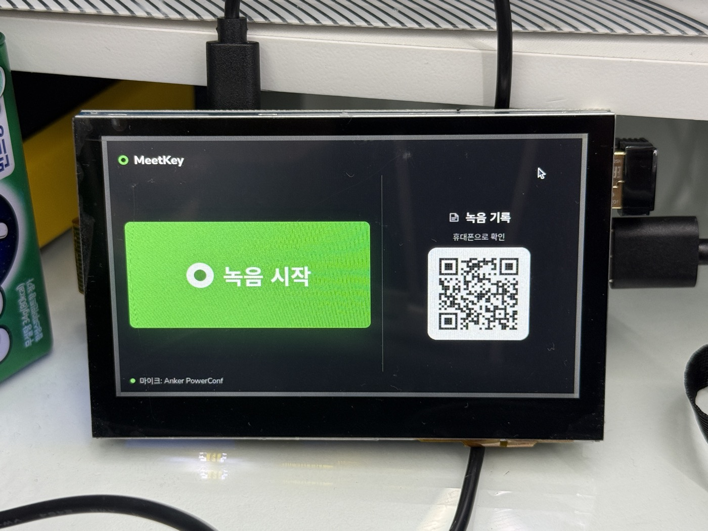
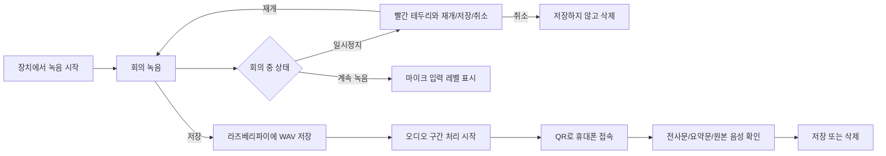
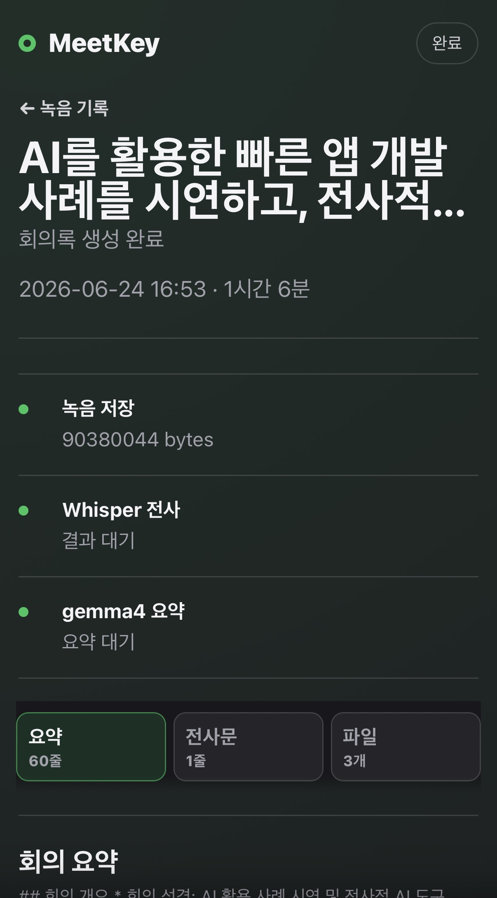
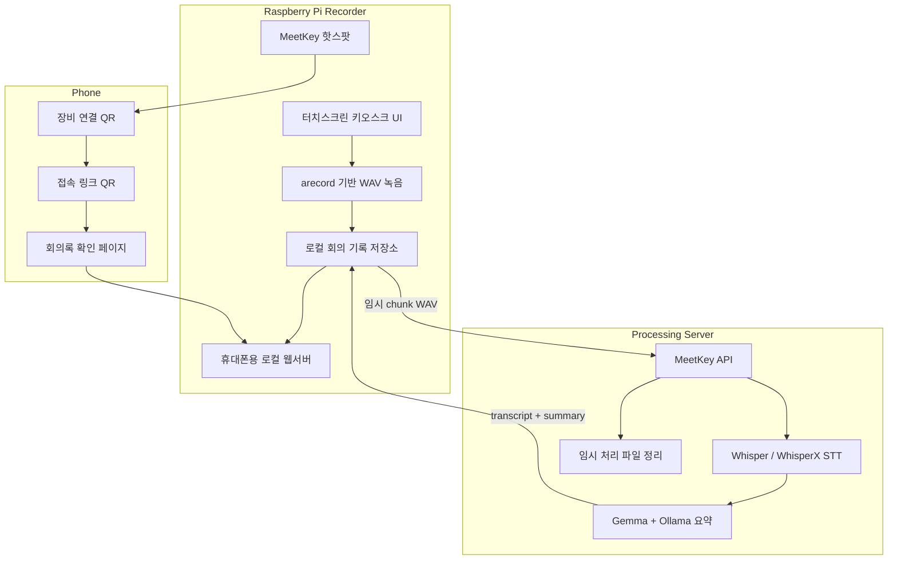
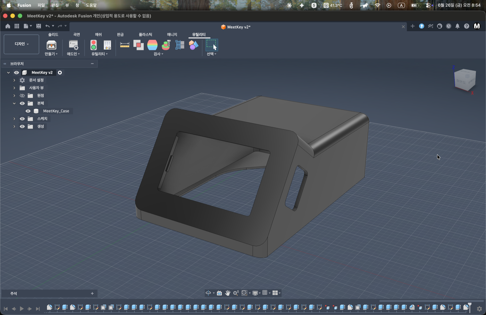
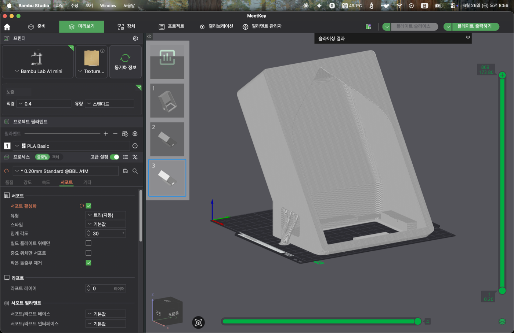
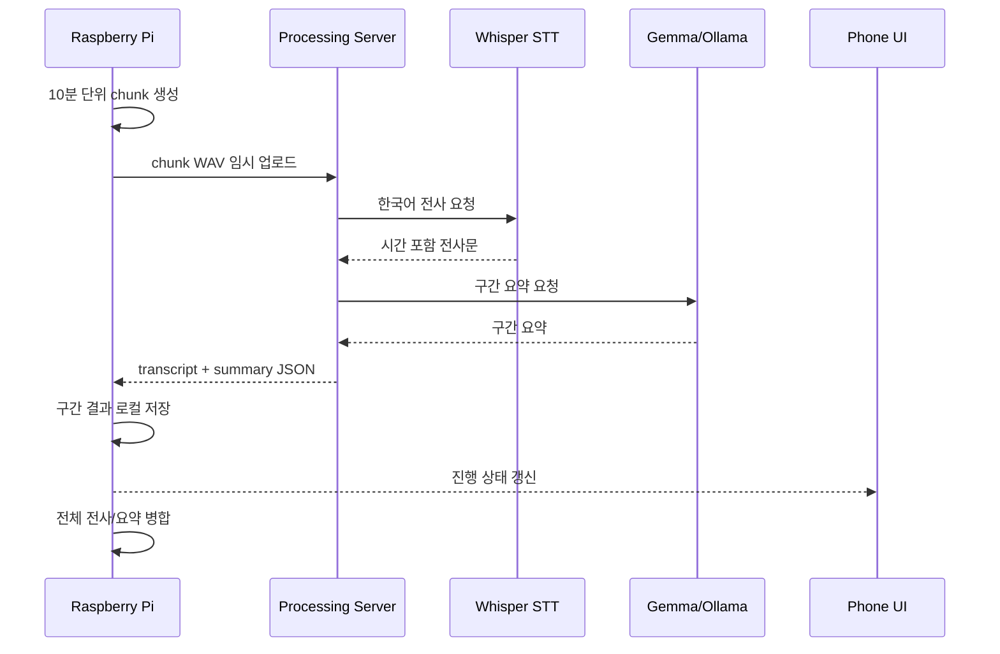

# MeetKey Recorder



**MeetKey Recorder**는 라즈베리파이와 USB 컨퍼런스 마이크로 만든 회의 녹음/전사/요약 PoC입니다. 회의실에 놓인 작은 장치에서 녹음을 시작하고, 회의가 끝나면 휴대폰으로 QR을 스캔해 원본 음성, 전사문, 요약문을 바로 확인하는 흐름을 구현했습니다.

이 프로젝트의 핵심은 단순히 “녹음 파일을 서버로 보내는 앱”이 아니라, **라즈베리파이가 회의 기록의 소유자가 되고 AI 서버는 임시 처리 작업만 수행하는 구조**입니다. 원본 데이터는 장치에 남기고, 처리 서버는 Whisper 전사와 Gemma/Ollama 요약을 수행한 뒤 결과만 반환합니다.

## 프로젝트 요약

| 항목 | 내용 |
| --- | --- |
| 목표 | 회의실에서 바로 쓸 수 있는 독립형 AI 회의 녹음 장치 PoC |
| 입력 | Anker PowerConf USB 컨퍼런스 마이크 |
| 장치 | Raspberry Pi 4 + 5인치 터치스크린 |
| 접속 방식 | 라즈베리파이 핫스팟 + QR 기반 휴대폰 접속 |
| 처리 방식 | 10분 단위 오디오 구간 전송, Whisper 전사, Gemma/Ollama 요약 |
| 저장 정책 | 원본 음성, 전사문, 요약문은 라즈베리파이에 로컬 저장 |
| 하드웨어 | Fusion 360 케이스 설계, 공차 테스트 2회, v3 전체 출력/조립 완료 |
| 현재 상태 | 실제 녹음, 저장, 전사, 요약, 다운로드까지 end-to-end 검증 완료 |

## 왜 만들었나

일반적인 회의 녹음 앱은 휴대폰이나 클라우드 서비스에 의존합니다. 하지만 회의실 공용 장비로 쓰려면 다음 문제가 생깁니다.

- 회의마다 누가 녹음 앱을 켤지 정해야 함
- 녹음 파일과 회의록이 개인 기기에 흩어짐
- 회의 직후 결과 확인까지 흐름이 끊김
- 회사 내부망이나 보안 정책 때문에 외부 클라우드 사용이 부담됨
- 긴 회의는 전사/요약 완료까지 시간이 오래 걸리는 것처럼 느껴짐

MeetKey는 이 문제를 **회의실에 놓는 작은 전용 장치**로 풀어보는 실험입니다. 장치 화면에는 꼭 필요한 버튼만 두고, 자세한 회의 결과는 휴대폰에서 확인하도록 UX를 나눴습니다.

## 사용자 흐름



회의가 끝나면 휴대폰으로 QR을 스캔해 아래 결과 페이지에서 요약, 전사문, 원본 음성을 확인합니다.

<p align="center">
  
</p>

> 실제 회의(약 1시간 6분)를 Whisper 전사와 gemma4:31b 요약으로 처리한 회의록 전체 예시: [06_Docs/sample_meeting_summary.md](06_Docs/sample_meeting_summary.md)

## 시스템 아키텍처



## 하드웨어 케이스 설계

MeetKey는 책상 위에 그냥 부품을 올려두는 형태가 아니라, 회의실에 놓을 수 있는 작은 전용 장치처럼 보이도록 케이스까지 설계했습니다. 5인치 터치스크린을 전면에 비스듬히 배치하고, 라즈베리파이와 케이블이 뒤쪽으로 정리될 수 있는 구조를 목표로 했습니다.

최종 조립에서는 마이크 받침부를 디스플레이 높이까지 올렸습니다. 디스플레이 프레임이 마이크로 들어오는 소리를 가리지 않도록 하기 위한 선택이며, 후면부는 마이크 높이 확보와 내부 배선 정리를 함께 고려한 형태로 설계했습니다.

| Fusion 360 설계 | Bambu Studio 출력 준비 |
| --- | --- |
|  |  |

케이스 설계에서는 화면 시야각, 케이블 배출, 장치 안정성, 출력 가능성을 함께 고려했습니다. 출력 전에는 Bambu Studio에서 적층 방향과 서포트 위치를 확인해 실제 프린팅이 가능한 형태인지 검토했습니다.

출력은 총 3번 진행했습니다. 1차와 2차는 전체 케이스를 뽑지 않고 디스플레이 결합부만 작게 출력해 실제 5인치 화면과 맞물리는 공차를 확인했습니다. 이 방식으로 필라멘트 낭비를 줄이면서 치수를 보정했고, 최종 수정이 끝난 v3 모델을 전체 출력해 라즈베리파이, 디스플레이, 마이크를 결합했습니다.

최종 STL 파일:

```text
hardware/MeetKey_Case_v3.stl
```

## 구간 처리 파이프라인

긴 회의는 한 번에 처리하면 사용자가 오래 기다리는 느낌을 받습니다. 그래서 녹음 중 일정 길이마다 구간을 만들고, 짧은 오버랩을 둔 뒤 먼저 처리할 수 있게 설계했습니다.



## 주요 구현 포인트

| 영역 | 구현 내용 |
| --- | --- |
| 장치 UI | 녹음 시작, 일시정지, 저장, 취소, 상태별 테두리 색상, 마이크 레벨 표시 |
| 휴대폰 UX | 장비 연결 QR과 접속 링크 QR을 분리해 iOS/Android 캡티브 포털 차이를 우회 |
| 저장 구조 | 원본 WAV와 최종 회의 결과를 라즈베리파이 세션 폴더에 저장 |
| 긴 회의 처리 | 10분 chunk와 overlap 기반 처리로 긴 회의의 대기감을 줄이는 구조 |
| 서버 역할 | AI 처리를 위한 임시 작업자 역할만 수행하고 최종 기록은 장치에 반환 |
| 결과 페이지 | Markdown 렌더링, 표 표시, 원본 음성/전사문/요약문 다운로드 |
| 운영 안정성 | systemd 서비스, Chromium kiosk, 핫스팟/AP 모드, 캡티브 포털 보조 |
| 하드웨어 | Fusion 360으로 전용 케이스를 설계하고 공차 테스트 후 v3 케이스 출력/조립 |

## 기술 스택

| 구분 | 기술 |
| --- | --- |
| Device runtime | Python, http.server, ALSA arecord |
| Device UI | HTML, CSS, Vanilla JavaScript, Chromium kiosk |
| Network | Raspberry Pi hotspot, captive portal helper, QR flow |
| Processing API | Python HTTP server |
| STT | Whisper, WhisperX/faster-whisper 연동 구조 |
| Summary | Ollama, Gemma 31B Q8 128K 설정 검증 |
| Deployment | systemd, shell scripts, labwc autostart |

## 현재 검증한 것

| 테스트 | 결과 |
| --- | --- |
| 라즈베리파이 화면 키오스크 실행 | 정상 |
| Anker PowerConf 마이크 인식 | 정상 |
| 실제 38초 녹음 저장 | WAV 생성 및 음성 레벨 확인 |
| Whisper 전사 | 시간 포함 전사문 생성 |
| Gemma 요약 | 회의 개요, 핵심 논의, 액션 아이템 생성 |
| 휴대폰 QR 접속 | 로컬 기록 페이지 접속 확인 |
| 파일 다운로드 | 원본 음성, 전사문, 요약문 다운로드 지원 |
| 케이스 설계/출력 | 디스플레이 결합부 공차 테스트 2회 후 v3 전체 출력 및 조립 완료 |
| GitHub 관리 | 민감 설정과 녹음 파일 제외 후 private repo 관리 |

## 폴더 구조

```text
02_Source/meetkey_poc/
  라즈베리파이 녹음 앱, 키오스크 UI, 휴대폰 페이지, systemd 설정, 핫스팟 스크립트

02_Source/meetkey_server/
  처리 서버, STT 래퍼, 기록/세션 페이지, 다운로드/저장/삭제 API

06_Docs/
  제품 기획 메모, PoC 명세, 요약 프롬프트 참고 문서

assets/
  README 이미지

hardware/
  3D 출력용 STL 파일
```

## 라즈베리파이 앱 실행

라즈베리파이 앱은 Python HTTP 서버와 정적 HTML/CSS/JS 화면으로 구성되어 있습니다.

```bash
cd 02_Source/meetkey_poc
cp config.example.json config.json
python3 app.py
```

장치 화면:

```text
http://localhost:8000/device
```

실제 배포 장치에서는 systemd와 Chromium 키오스크 모드를 사용합니다.

```bash
./scripts/start_server.sh
./scripts/open_kiosk.sh
```

## 처리 서버 실행

처리 서버는 라즈베리파이에서 보낸 오디오 구간을 받아 전사와 요약 결과를 반환합니다.

```bash
cd 02_Source/meetkey_server
cp config.example.json config.json
python3 app.py
```

실제 전사를 위해서는 아래 중 하나를 설정할 수 있습니다.

- 외부 전사 명령어
- WhisperX
- faster-whisper
- 로컬 ASR API 래퍼

가벼운 통합 테스트는 mock 모드로 실행할 수 있습니다.

```bash
MEETKEY_STT_MODE=mock MEETKEY_SUMMARY_MODE=mock python3 app.py
```

## 설정 관리

실제 런타임 설정 파일은 git에 올리지 않습니다.

아래 예시 파일을 복사해 각 환경에 맞게 수정합니다.

```text
02_Source/meetkey_poc/config.example.json
02_Source/meetkey_server/config.example.json
```

실제 Wi-Fi 비밀번호, 서버 주소, 녹음 파일, 전사/요약 결과, 로컬 배포 설정은 커밋하지 않는 것을 원칙으로 합니다.

## 앞으로 개선할 항목

- 실패한 구간 처리 재시도 큐
- 저장/삭제 등 기록 생명주기 UX 강화
- GPIO 하드웨어 버튼 연동
- 화자 분리와 단어 단위 타임스탬프 개선
- 새 라즈베리파이 설치 자동화
- 장시간 회의 테스트와 안정성 보강
- 케이스 내부 고정 구조와 케이블 정리 개선

## 개발 의도

이 프로젝트는 완성된 제품이 아니라, 실제 회의실에서 사용할 수 있는 녹음 장치 UX를 검증하기 위한 PoC입니다. 핵심 목표는 “회의가 끝난 직후 휴대폰으로 바로 결과를 확인할 수 있는가”, “긴 회의도 빠르게 처리되는 것처럼 느껴지는가”, “원본 데이터 소유권을 라즈베리파이에 둘 수 있는가”를 확인하는 것입니다.
